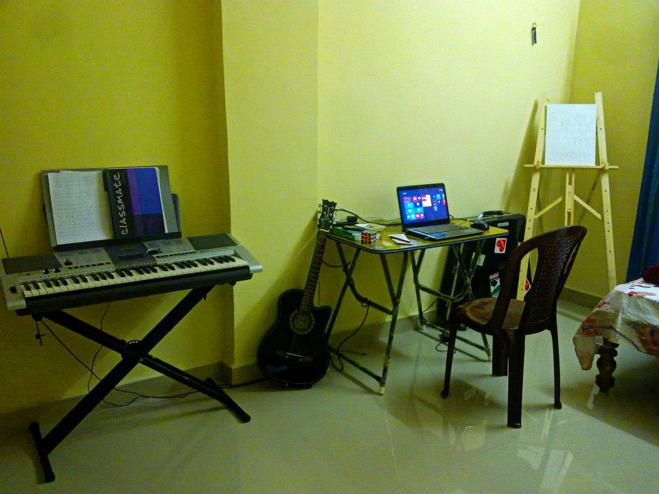

I started my musical journey very early, around the age of 3. As a kid, I used to like listening to music. My dad took me to a cassette store and I chose a flute recital of [Pandit Hariprasad Chaurasia](https://en.wikipedia.org/wiki/Hariprasad_Chaurasia) as a present for myself. That was the beginning as I recall.
A few days months later, after much struggle, my parents were able to find a home tutor for me who would teach me Bengali Vocal. Jayanta Sir, took up that difficult task to train a 3 year extremely fidgety kid, who could barely reach his arms across to the bellow of the [harmonium](https://en.wikipedia.org/wiki/Pump_organ#Harmonium). 
I started out with some basic vocal trainings, eventually learning, like any stereotypical Bengali kid, [Rabindrasangeet](https://en.wikipedia.org/wiki/Rabindra_Sangeet). As Sir and my parents soon realised, I always focused more on playing the instrument than my singing. Music and the rhythm was more important for me. There on, I started liking more [Nazrulgeeti](https://en.wikipedia.org/wiki/Nazrul_Geeti), which are typically more fast paced.
Sir used to accompany me with the [table](https://en.wikipedia.org/wiki/Tabla), while I sung while playing the harmonium. I learnt some basic Indian classical ragas and to recognise taals.

When I shifted from Purulia to Kolkata, everything changed. This was no exception. I took tution under .. . This is when I came in contact with his son, Shyamal da, who accompanied me with the tabla. He quickly became my friend, philosopher and guide. From watching music videos together to trying out experimental beats.
I passed the first two levels of Indian classical exam under the Allahabad gharana. While I was mostly learning Nazrulgeeti, sir was very inclined to teach me hymns of Kali and Krishna. This never grew on me. I was rather moving towards Bengali modern music (Adhunik), or Nachiketa, Indranil, Shyamal Mitra, etc.

I changed my tutor to Banichakra. I pursued Sir to teach me Bengali poetry songs (Chorar gaan) as I found those rhythmetic and funny. I was way past the age to learn those, so it took some convincing. My voice change in adolescence was a serious roadblock. My parents had to buy me a new scale-changing harmonium.
However, my interest in vocals were dwingling. And soon, with the study pressure, I had to choose between my co-curriculums. 

The piano at school attracted my curiosity. Specially the digital synthesizers and keyboards that used to steal the show at the talent contests. I coerced my parents to enroll me for keyboard lessons, at Banichakra, under .. . Learning the staff notation for almost half an early totally crushed my dreams. The slow learning curve of Western Classical was very different from how I imagined myself forming a musical band and performing at school events.
After an year or so, I left Banichakra and started learning to play Bollywood songs under Shyamal da. We used to listen and play a variety of songs, Kal Ho Naa Ho, Indian Idol, Summer of 69, Backstreet Boys, Fame Gurukul, ... Most importantly, around this time I came across Yanni, who since then has remained my favourite music composer. Santorini and Keys to Imagination used to be on infinite loops whether I was awake or asleep. Metals and rap were quite popular among my friends but I still find myself very away from both this genre.

This is about time when I met Subhasish, one of my dearest friend at school. He had always been my hero when it comes to playing the keyboard. We did perform together at a few school events, even winning laurels. But to say the truth, I was just holding up some chords at low volume that he told me to play as a background for his notes.
While I will always regret not having learnt piano the methodical way and falling for the trap of fame, I do forgive my shortsighted younger self. I did what I thought would maximize my happiness at that time.

During my college, I performed at various college events and fests. We had a fusion music band with my friends Naveen (violin/flute), Ajit (drums), Arindam (guitar) and me on the keyboard. I also performed a few vocals in English, Hindi and Bengali in the span of 4 years. 

I briefly learnt [Santoor](https://en.wikipedia.org/wiki/Santoor) from [Chiradip Sarkar](https://www.youtube.com/user/dipsantoor/) during few college vacations. He is a dear student of [Pandit Tarun Bhattacharya](https://en.wikipedia.org/wiki/Tarun_Bhattacharya), who inturn was a student of [Pandit Ravi Shankar](https://en.wikipedia.org/wiki/Ravi_Shankar).
Wiki: The Indian santoor instrument is a trapezoid-shaped hammered dulcimer, and a variation of the Iranian Santur. The instrument is generally made of walnut and has 25 bridges. Each bridge has 4 strings, making for a total of 100 strings. It is a traditional instrument in Jammu and Kashmir, and dates back to ancient times. It was called Shatha Tantri Veena in ancient Sanskrit texts.

<iframe width="340" height="290" src="https://www.youtube.com/embed/C2jwsjriQcU" frameborder="0" allow="autoplay; encrypted-media" allowfullscreen></iframe>

During my time at Bangalore, my roommate and friend/collegue from IIST/ISRO, Arpan and I used to jam once in a while at home. He used to have an octopad. I also played and sung twice at ISRO at official events.

Yes, my old Rabindrasangeet skills are rusty now but I do enjoy participating in [family events](https://www.youtube.com/watch?v=iTf0PB0M2eM&t=1100s).